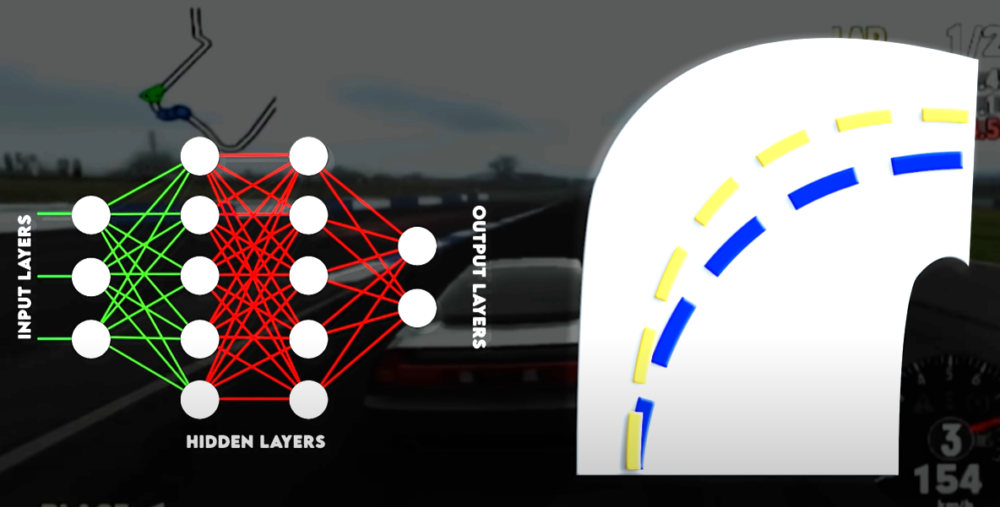
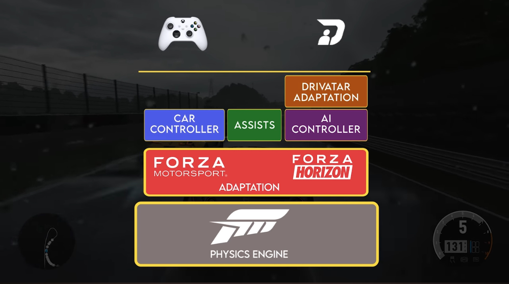

 # COMP3180 Final Project

Included is a rough timeline below. Fill this in from week to week to show your progress throughout semester.

<details>
  <summary>Markdown formatting tips (Click to expand)</summary>
  Below are a number of tips for adding images and other formatting to your journal. We recommend you give them all a go. You can remove this section from your journal when you are done with it.

  ## Inserting images
  You can (and should!) insert images into your journal. To do so, place the images inside a folder within your repo and insert them using the following template, replacing text in "<>" appropriately:
  ```
  
  ```
  For example:
  ```
  
  ```
  ## Inserting Quotes
  Quotes can be a useful way to add sections from your readings into your journal for reference later. To add them, place a ">" marker in front of each line (or using `<br>` to seperate them). Example:

  > This is the first line of my awesome quote!<br>And here is another line! How cool!

  No marker here, so the quote is broken. But I can bring it back...
  > Like this!

  ## Inserting Code
  Code snippets can be a good way to place algorithms, formulas or other such things into your documentation for illustrative purposes (or if your project requires installation instructions). You can insert code by placing three backticks (```) above and below the code breakout. Like this:

  ```
  if (noCoffee)
  {
    coffeePot.refill();
  }
  ```
  If you want to add a very short snippet of code into a paragraph, you can instead use single Backtick, `Like this!`.

  Please let us know if you need help doing anything else in Markdown!
</details>

## Week 1 - Selecting a Project

You need to have accepted this assignment repo and made a post here identifying a resource relevant to your topic.

Artificial Intelligence in games:

So I wanted to explore how AI has been used in the video games industry and I found a fantastic article/youtube video on it: https://www.aiandgames.com/p/how-ai-is-actually-used-in-the-video

The article and the video really helped me get a highlevel understanding of how the games industry have been using artificial intelligence. 


So there are two types of AI that can be used its either Symbolic AI or Machine learning:

Symbolic learning using states that compromise of diffrent problems allowing the system to search within these states to find sequences of actions to solve a particular problem.

Machine learning on the other hand is a set of algorithms that learn a solution of a problem based on given data on similar problems and here the system iteratively reduces the error in achieving the solution.

The article also helps in categorizing the way AI is used in the idustry but the one that really got me iterested is the use of AI in terms of player's game experience. Particularly AI that plays in the game. 

The idea that I got from reading the article was to implement an AI that mimics the behaviour of other players in the game and the best examples that I found of that was of the Drivatar in the forza series of games and the Sophy AI in gran turismo. These types of AI learn from the behaviours of other players or your friends in that game and mimic that behviour when the player is offline. 

Another article that I found on the Drivatar AI of forza really dives deep into how these types of AI functions: https://www.gamedeveloper.com/design/how-forza-s-drivatar-actually-works

The interesting thing that i found from the article is that these AI not only follow the behaviour of other players based on events that have already taken place but it also learns from those events to make decisions for situations which the players might not have encountered yet like if a player never drove a certain car then the AI tries to make decisions based on what the player would have done in a similar situation. 

Based on what I have read and explored I would like to make a similar AI that learns from othe players behaviour and mimics them. I am still not sure as to which game to implement this in but it could either be a basic racing game or maybe even chess.

One of the main things that I will need to research is the rules and boundaries that I would need to set for the AI to actually feel like human behaviour rather than a basic AI bot.

## Week 2 - Narrowing Focus & Tool Familiarisation

This week I delved deeper into how the Drivatar AI works in Forza series of games.

I found two very compeling resources one being the article: https://www.gamedeveloper.com/design/how-forza-s-drivatar-actually-works and another being a youtube video: https://www.youtube.com/watch?v=JeYP9eyIl4E&list=PLy7spO5WqZW71dC-LIaAu0FKmNNxJHcmu&index=2

After having gone through both of these, following are my findings:

The type of AI that is being used in the case of Drivetar is the one that models a player. This AI learns from how a player plays, makes intelligent assumptions of behviours that the player might not even have encountered before. The Ai basically asks this question what would the player have done in this situation?

A racing game like Forza has a complex physics engine that has many variables that can affect the way the car gets driven in the game like car horsepower, speed, velocity, direction, weather, traction.. etc. There are so many variables that traditional symbolic AI would not have been able to handle this so machine learning gets deployed here as it is good at identifying patterns.

In Forza there are different layers of AI, the first AI being the one that interacts with the physics system and knows how to find the best path for the player to take and this can be seen in the game.


Then comes the drivetar layer that tweaks this AI layer which knows the most effective path to simulate the playstyle of another player.

Now coming to the details of drivatar itself, drivatars were initially made using the artificial neural networks but it was soon discovered that these neural networks only work for specific scenarios so to add some variance they started using Baysian Artifical neural networks. These neural networks follow the Bay's theorem which means now eahc decisions has probability. In terms of forza it means what is the probability of applying utility A to the the given road condition B.



The drivatar usually suggests one or more options for each scenario and choose the option it is the most confident about. The track gets broken down into different types of turns and then the drivatar obsereves the patterns of you driving on each of those turns. Each time the player plays the game the drivatar gets updated on the cloud and treats the older readins with less confidence.

There is another layer to tweak the drivatar to avoid the drivatar from making agressive plays like bumping into others to make space. It is done so that the drivatar is like a professional version of you .


Ruber banding is another thing that is being handeled by this layer where if the player is far behind other cars in a race the other cars get rubber banded and they decrease their perfomance so that they can somehow match the performance of the player.

## Week 3 - Research (Reading & Prototyping)

An Architecture Overview for AI in Racing Games. (2013). In Game AI Pro. CRC Press LLC. https://doi.org/10.1201/b16725-44

This week I looked into academic resources for my research and the best one that I found is the:
An Architecture Overview for AI in Racing Games. (2013). In Game AI Pro. CRC Press LLC. https://doi.org/10.1201/b16725-44

In chapter 38 of this book the author mentions that in simple racing games the AI advances on a predifined spline and we just need to emulate the correct cornering speed, acceleration and braking based on parametric formulas and also basic collision detection.

The architectuire of the AI system is divided into 4 layers:

1. Character/Persona Layer: This layer controls the skill level of the driver
2. Strategic Layer: Houses the behavioural elements controling the broader steering and speed goals based on a short/medium distance
3. Tactical Layer: Will be processing the input every frame and getting solid values out of the speed goals 
4. Control Layer: This is layer reposible for implementing the stategy developed by the above 2 layers. It calculates the controller inputs i.e steering, breaking and throttle.

The way AI drivers are distinguishable is through the differentiation in skill which is aggression, vehicle control and mistakes. but since this is a racing game the difference in drivers must be kept small as all of them will be driving similar cars in terms of performance and that all drivers are almost driving to the limit so instead of the traditional AI where we have a range (0,100) here we have (98,99) even though the difference seems small the difference acculmaltes over multiple laps and similarly we can have a lower range i.e (75,76) to have an easier difficulty.

However the small range leads to the issue of there being no difference between drivers so biorythm is applied in which the skill factor will vary with time like sine wave. otherways to counter the issue is to use the secondary characteristics like a driver with more mistakes can be overtaken when they make make an error.

Racing has different behaviours but they are not that large so they can easily be represented by Finite state machines(FSM). Each behaviour competes to be active on every update of the strategic layer. The state is decided based on the utility score. The behaviours are: 

1. Normal driving: Here the AI should stay as close to the optimum path as possible. The utility for this is a constant thst other behaviours must beat to change the state.

2. Overtake: Here the AI sells a line that could be followed to pass one or more cars ahead of it. In this case alot of variables are taken into account such as whether the cars infrpnt of you are about to take a corner presenting an opportunity, if there is a significant speed advantage then the mode should be activated. This behaviour doesn't need to consider the fine detail as the tactical layer and the avoidance system will take care of the a  overtaking. Once the overtaking mode is activated the driver AI should be more agressive and even take risks at different points. However it should still have the biorythm to make it miss the overtakes a few times.

3. Defend and block: This state opperates by making small steering moves to block off another driving that is approaching from behind or has some sort of speed advantage. An issue with this is that this can push them off track so this can be avoided by allowing aposing drivers to post a complaint message.

4. Branch: The AI must decide the best brach they should go towards again based on alot of variables.

5. Recover:  There can be sepertae triggers for the revocery mode such as pointing the wrong way, spining out etc. The AI has to get back to the Normal driving mode as fast as possible while avoiding other cars that might have crashed.


## Week 4 - Research (Reading & Prototyping)

This week I continued my reading on An Architecture Overview for AI in Racing Games. (2013). In Game AI Pro. CRC Press LLC. https://doi.org/10.1201/b16725-44

In chapter 38 I further learned the follwoing:

Choreographer for races:

- A race choreographer is a scripting system that reacts to events from the main game code, the physics system, or AI vehicles to change the dynamics of the race.
- It can modify physical or AI conditions, such as triggering a tire blowout or altering a driver's skill level in the middle of a race.

Interfaces:

- It should be possible to swap out control of the vehicle by having the AI interact with it in a manner similar to that of a human player.
- In order to query other AI vehicles for information, AI must have access to measurements from the physics system. This mimics real-world driving, in which skilled drivers predict the moves of their rivals.

Keeping the AI in Check:

- To guarantee a competitive experience, maintain car distribution throughout the track, and keep - players interested, AI must be balanced.
- Rubber-banding is one technique used to dynamically alter AI performance to match the player's progress, giving players an equal chance of winning at the end of the race.
- Since AI may employ a condensed version of the physics engine, balancing requires modifying both AI behavior and vehicle physics.

Automated Learning Offline:

- AI performance and racing lines can be optimized by automated learning techniques such as genetic algorithms.
- Numerous factors can be efficiently managed by genetic algorithms, which enhances other parameters and racing line optimization.
- Difficulties include the requirement for manual modifications due to the opaque nature of automated solutions and the complexity that increases with more parameters.


## Week 5 - Presentations (& research/rescoping)

I continued reading the book Games AI prr, I read the chapter 39 which helped me understand how a race track is broken down:

Curvature's radius:

- The maximum cornering speed of a vehicle is determined by taking into account the radius of curvature.
- The distance to the next node and the tangent of the track curve at a node are used to calculate it. The equation 𝑟 = 𝑑sin⁡(𝜃) equals r = sin(θ)
- This radius is determined by the formula d, where d is the node distance and θ is the angle formed by the tangent and link vectors at the node.
- Especially if the AI is off the racing line, the radius of curvature is a more effective tool for estimating turning speeds than the track center.

Curved Nature of the Track:

- Although actual segments are curved, tracks are represented as piecewise linear segments. This implies that all location references are imprecise, and physical world coordinates should be used for fine-grain collision avoidance.
- A genuine track segment's radius of curvature is a variable, instantaneous value.


Driving the Track:

- Steering: Aim the steering using a look-ahead distance to prevent making unnecessary corrections. Track curvature and vehicle speed should be connected to the look-ahead distance.
- Corner Speed and Braking: The local radius of curve, vehicle mass, velocity, and grip force all affect the maximum cornering speed. Braking must to be modified in accordance with anticipated speeds and track nodes. Recalculating every few frames contributes to accuracy preservation.
- Wall Avoidance: Project future vehicle locations for medium-range avoidance and make necessary corrections if they are outside the track. Make minor adjustments for short range depending on how close to walls you are. Control layers based on PID can help with this.

Racing Lines:

- While it may not always be the fastest in a given area, the ideal racing line is the one that cuts down on lap time. The car should follow the saved racing route, even though it might not match the actual driving path.
- Racing line generation can be done automatically (the most efficient option) or by hand editing. The line should be modified for various automobile kinds and take the vehicle's capability into account.

Using Splines:

- Track curves can be represented more accurately by substituting splines (such as Catmull-Rom or Bézier) for piecewise linear approximations. However, tangent estimates and registration for splines need iterative procedures.


## Week 6 - Presentations (& research/rescoping)

This week i spent time rescoping my project based on the research that i did in the previous weeks.  

Data collection: 
- I will be utilizing player data from my own gameplay sessions

Modelling human behaviour: 
- Basic AI for acceleration, braking and cornering
- lookahaead steering refinement
- Advanced physics adjustment
- Testing and debugging 

## Week 7 - Research Finalisation

This week i spent time developing a project timeline:

Week 8 and break W1: Setup and Basic AI Framework
  - **Tasks**:
    - Set up the Unity project, import vehicle models, and configure basic vehicle physics (acceleration, braking).
    - Implement a basic racing track with a few straight sections and corners for testing.
    - Begin implementing a simple FSM (Finite State Machine) to control the AI's basic actions (Acceleration, Braking, Cornering).

Break Week 2 : Acceleration and Braking AI
  - **Tasks**:
    - Develop basic algorithms for acceleration and braking based on track conditions.
    - Test the AI to ensure it speeds up on straights and slows down appropriately before corners.
    - Fine-tune the transition between acceleration and braking states.
  
Week 9 : Cornering AI
  - **Tasks**:
    - Implement the cornering logic so that the AI adjusts speed and steering when approaching and navigating turns.
    - Use track curvature data or predefined corner zones to trigger braking before corners.
    - Test cornering performance on different curves (wide vs sharp turns).

Week 10 : Look-Ahead Steering and Refinement
  - **Tasks**:
    - Implement the look-ahead steering algorithm to allow the AI to smooth out its path through curves.
    - Adjust the steering logic so that the AI doesn’t oversteer or understeer.
    - Test and refine AI behavior to prevent excessive wobbling or course correction.

Week 12 : Advanced Physics Adjustments
  - **Tasks**:
    - Integrate more advanced physics considerations such as friction, drag, and grip.
    - Adjust braking and acceleration behavior to account for different road conditions and track types (e.g., dirt, asphalt).
    - Continue testing and refining AI behavior based on track variety.


## Week 8 - Project Development

## Mid-semster break 1 - Continued R&D

## Mid-semster break 1 - Continued R&D

## Week 9 - Project Development

## Week 10 - Project Development

## Week 11 - Project Evaluation

## Week 12 - Project Evaluation

## Week 13 - Project Report & Deliverables Finalisation

